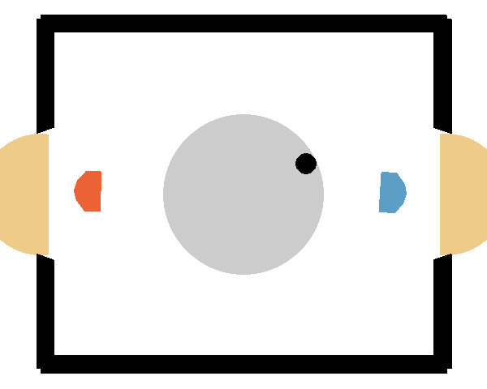

# Laserhockey: A Team

This repository contains our three algorithms, which competed in the 2023 Reinforcment Learning Hockey Challenge
at the University of Tübingen.

The environment can be found here: [laser-hockey-env](https://github.com/martius-lab/laser-hockey-env)

The tournament results can be found here: [RL2023 Hockey Tournament](http://al-hockey.is.tuebingen.mpg.de)

# Algorithms

We implemented three different algorithms to solve the task:

- DDQN
- DDPG
- SAC

# Use 

Our trained agents can be found in their respective folders. (agent\_\<algorithm\>.\<pke/pth\>) 

These trained agents can be used for playing airhockey by running their respective play\_\<algorithm\>.py-function.
New agents can be trained with train\_\<algorithm\>.py.

The definition of the agent itself can be found in agent\_\<algorithm\>.py.

# Compare agents

Our agents can be used to play against each other with the function compete.py.
Here is a preview of the gameplay of DDQN against SAC:

